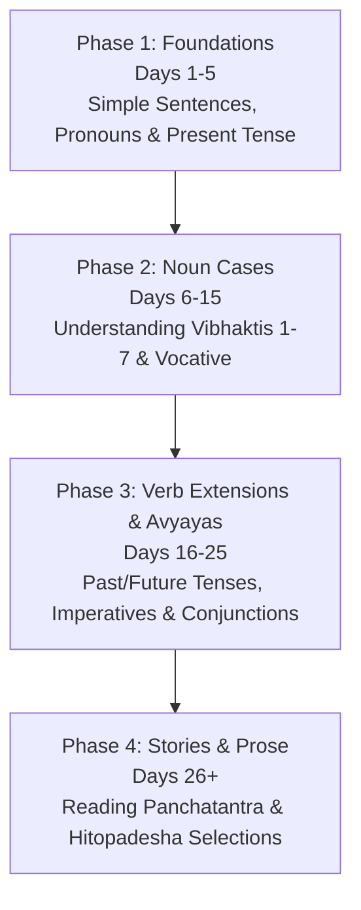

# संस्कृत-शिक्षणम् (Sanskrit Learning Dashboard)

Welcome to your daily Sanskrit learning workspace! This dashboard is designed to track your progress and serve as a central hub for grammar references, vocabulary lists, and daily lessons.

---

## 📊 Learning Progress

*   **Current Lesson**: [Day 002 - Simple Sentences & Masculine Nouns](file:///Users/karthikbhat003/Documents/Saskrit%20Learning/Lessons/Day_002_Simple_Sentences_and_Masculine_Nouns.md)
*   **Status**: 🟦 In Progress (Day 2)
*   **Last Updated**: 2026-08-23

### Quick Stats
| Metric | Count | Details |
| :--- | :---: | :--- |
| **Completed Days** | `1` | Next up: Day 2 |
| **Active Vocabulary** | `35 words` | Grows with each lesson |
| **Grammar Concepts** | `4` | Greetings, 'To Be' forms, Masculine Nouns, Agreement |

---

## 🗂️ Workspace Map

### 📚 Reference Library
Access these sheets anytime you need to look up a rule, spelling, or declension pattern.
*   **[Script & Pronunciation](file:///Users/karthikbhat003/Documents/Saskrit%20Learning/Reference/Pronunciation_and_Script.md)**: Alphabets, Devanagari script, and pronunciation guide.
*   **[Noun Declensions (Vibhakti)](file:///Users/karthikbhat003/Documents/Saskrit%20Learning/Reference/Vibhakti_Table_Noun_Declensions.md)**: Tables for cases (nominative, accusative, etc.) across genders.
*   **[Verb Conjugations (Dhatu Rupa)](file:///Users/karthikbhat003/Documents/Saskrit%20Learning/Reference/Dhatu_Rupa_Verb_Conjugations.md)**: Verb tables for various tenses (Lakāras).

### 📖 Vocabulary Hub
*   **[Cumulative Glossary](file:///Users/karthikbhat003/Documents/Saskrit%20Learning/Vocabulary/Cumulative_Glossary.md)**: A running dictionary of all words introduced in the lessons.

### 📝 Lessons Directory
*   **[Day 001: Prathama Parichaya](file:///Users/karthikbhat003/Documents/Saskrit%20Learning/Lessons/Day_001_Prathama_Parichaya.md)** (First steps, greetings, and basic pronoun-verb pairs)
*   **[Day 002: Simple Sentences & Masculine Nouns](file:///Users/karthikbhat003/Documents/Saskrit%20Learning/Lessons/Day_002_Simple_Sentences_and_Masculine_Nouns.md)** (Simple subject-verb agreement and masculine $a$-ending nouns)

---

## 🗺️ Syllabus Roadmap

### Phase Details

#### Phase 1: Foundations (Days 1–5)
*   **Day 1**: Basic greetings, pronouns (sah, eshah, aham, bhavan/bhavati), and simple verbs (asti, bhavati).
*   **Day 2**: Simple sentences, Subject-Verb agreement, and nouns in Masculine ($a$-ending).
*   **Day 3**: Introduction to Feminine ($ā$/$ī$-ending) and Neuter ($a$-ending) nouns.
*   **Day 4**: Plurality (Singular, Dual, Plural) and basic questions (kim, kutra, kada).
*   **Day 5**: Present tense verbs (lat lakāra) in all three persons (Prathama, Madhyama, Uttama purusha).

#### Phase 2: The 8 Noun Cases (Days 6–15)
*   **Days 6–7**: Nominative (Prathamā) & Accusative (Dvitīyā) - Subject and Object.
*   **Days 8–9**: Instrumental (Tṛtīyā) & Dative (Caturthī) - Instrument and Purpose.
*   **Days 10–11**: Ablative (Pañcamī) & Genitive (Ṣaṣṭhī) - Source and Possession.
*   **Days 12–13**: Locative (Saptamī) & Vocative (Sambodhana) - Location and Addressing.
*   **Days 14–15**: Consolidated case exercises and short reading comprehension.

---

## 🚀 How to Learn Daily

1.  Open the day's lesson file (e.g., [Day 001](file:///Users/karthikbhat003/Documents/Saskrit%20Learning/Lessons/Day_001_Prathama_Parichaya.md)).
2.  Read the **Subhashita** (quote) to warm up.
3.  Read the **Gadhya Patha** (prose passage) in Sanskrit, transliteration, and English.
4.  Go through the **Padavibhaga** (word breakdown) and **Shabda Kosha** (vocabulary) to understand how the sentence is constructed.
5.  Study the **Vyakarana Vishesha** (grammar notes) to understand the underlying rules.
6.  Complete the **Abhyasa** (exercises) in your mind or as notes.
7.  **To get the next lesson**: Simply prompt me:
    > *"Give me a gadhya patha today as a continuation"*
    I will automatically inspect this workspace, read the metadata to see your progress, update the files, and write the next lesson (Day 002, Day 003, etc.) for you!
